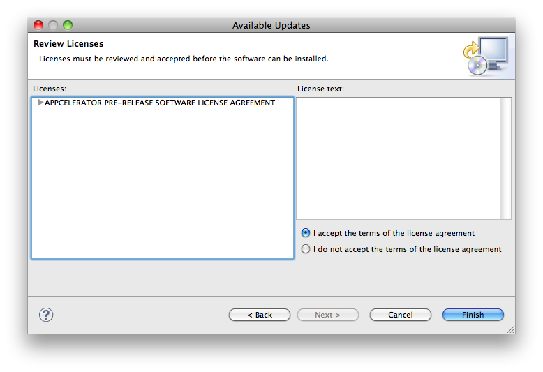

第二章 Titanium Mobile環境構築（２）Titanium Studioのインストール
========================================================
Titanium Mobile(SDK)自体は単体ではコンソールベースで動作する開発環境ですが、Titanium Studioはいわゆる統合開発環境であり、ソフトウェアに内蔵されたエディタによる入力補完、ウィザード形式で作成できるプロジェクトやその管理、プログラムソースのビルド、シミュレータや実機への転送、配布用のファイル作成といった一連の挙動をGUI上で総合的に行うことができます。
Titanium Studioをインストールすることで連動してTitanium Mobileを含むTitanium SDKのセットアップも行うことが出来ます。

##ダウンロードとインストール

以降の手順はAppceleratorのサイト更新に伴って導線が変わる可能性があります。
基本的に「ログイン」（もしくはユーザ登録）→「ユーザ向けメニュー画面」→「メニュー内からTitanium Studioのダウンロード」という流れ自体は変わらないはずですので、適宜読み替えてください。

Appceleratorのサイトにアクセスし、ページ中央部にDOWNLOAD TITANIUMと書かれているボタンをクリックするか、以下のアドレスを直接入力してください。

http://www.appcelerator.com/products/download/ 

Download Titaniumの画面に遷移します。
ここでは無料で使用できるCommunityのダウンロードを行いますので、画面右側にある"Get Started"ボタンをクリックします。  

そうすると、このようにログインかユーザ登録を促される画面が表示されます。
すでに別環境の構築などを通して、Appceleratorのユーザ登録をされている場合は"Please login"のリンクを、まだユーザ登録をされていない場合は"register"のリンクをクリックしてください。ここではユーザ登録する前提で進みますので、すでに登録済みの方は少し先まで飛ばしてください。

ユーザ登録画面が表示されます。
必須項目はAppceleratorのユーザアカウントとなるメールアドレス、そのユーザアカウントに紐づくパスワード、それに加えて姓名と所在地の登録といった個人情報になります。
姓名については特段不都合が無い限り、英語表記にされておいたほうがよいでしょう。
ちなみにこちらに登録したメールアドレスにはAppceleratorから随時メールによるアナウンスがおこなれます。

すべての必須項目に入力後、契約内容などへの承諾チェックをONにして "Sign Up"ボタンをクリックしてください。一度登録しているメールアドレスには登録できないので注意しましょう。
登録が終わると画面が遷移します。

ユーザ登録済みの場合はアカウントメールアドレスとパスワードを入力してください。

登録処理・認証処理が終わると、ダウンロード可能になるTItanium Resourcesのページに遷移します。
Downloadsというリンクが左上の部分にあるので、ご利用のプラットフォームに合わせてダウンロードをしてください。
なお、Titanium Studioのサイズは120MB〜150MBといった巨大なファイルですので、回線の帯域や時間に余裕のあるタイミングでのダウンロードをお薦めします。

###Mac OS Xの場合
ダウンロードしたTitanium Studio.dmgファイルをダブルクリックしてマウントし、以下の画面が表示されたら、画面の表示のように左上のTitanium Studioのアイコンを右下のApplicationsフォルダへのショートカットにドラッグアンドドロップします。
コピー後、アプリケーションフォルダ内のTitanium Studioを起動してください。

###Windows 7の場合
ダウンロードしたTitanium Studio.exeを実行し、画面指示に従いインストールしてください。


後に触れる起動時のログイン処理直後にWindowsファイアウォールの設定確認が表示される場合がありますので、アクセスを許可するようにしてください。

##Titanium Studioの起動
Titanium Studioを初めて起動すると、メールアドレスとパスワードを要求されます。
一度、ログインしておくことで、この認証の確認処理自体は次回以降スキップされます。（ただしネットワーク接続されている必要があります）


企業内での利用などでHTTP Proxyを介してインターネット接続をしている場合、ログイン画面の右端にある「Proxy Setup...」を選択して、接続先のHTTP Proxyサーバのホスト名とポート番号、認証Proxyの場合は、ユーザ名とそのパスワードを入力してください。

###【コラム】テキストエディタの用意

> Titanium Studioは高機能な統合開発環境ですが、JavaVM上で動作するため緩慢な部分があるのは否めず、開発環境のスペックによっては本来Titanium Mobileで得られるはずのハイパフォーマンスな開発速度を活かせない可能性があります。
> 
> そこで開発においてコーディングの部分を使い慣れたテキストエディタを利用し、実行やデバッグといった作業だけをTitanium DeveloperやTitanium Studioを活用するという方法があります。
> エディタとしてはもちろんメモ帳レベルのものでも構わないのですが、最低でもJavaScriptのコードハイライト機能などがついたエディタを選択した方が良いでしょう。
> また、日本語環境特有の問題なのですが、日本語のようなマルチバイト文字を利用する場合にはソースファイルをUTF-8で保存する必要がありますので注意してください。
> 
> すでにこういったエディタをお持ちの場合でない場合はTitanium MobileのAPI入力補完1に対応したKomodo Edit2がおすすめです。
> Appceleratorの開発者の方はシェアウェアのTextMate3を活用されています。

##Titanium Studio画面構成

ログインするとTitanium Studioのワークベンチ画面が表示されます。
この画面自体はTitanium StudioのベースとなっているAptana Studio、さらにそのベースとなっているEclipseの画面とほぼ同じです。それらを使われたことがある方には馴染みやすいと思いますが、使われたことの無い方も多数いらっしゃると思われるので、Titaniumと関係しない部分についてまず解説したいと思います。

###Titanium Studioの画面構成
Titanium Studioの画面を構成する主たる要素について軽く触れたいと思います。

####ViewとPerspectiveについて

Titanium Studioには画面内に複数のサブウィンドウ（Viewと呼びます）が存在します。
それぞれのViewにはタブによる見出しがついており、View同士をスタック（重ねる）させることができます。標準では画面下部に展開されているこのView群にはConsole View・Terminal View・Problems View・Search View・Progress Viewがひとかたまりになっている状態です。
タブ見出し部分をドラッグすると、スタック解除された状態になり自由に配置可能になります。
スタックされた順番も自由に変更することができます。
Viewの見出しをダブルクリックすると、ワークベンチ内で最大化されます。
エディタ部分もファイル単位でViewとして分割されるので、個別に最大化や縦横に分割表示することも可能です。


ワークベンチのViewの構成を保存することができます。この構成のことをPerspective（パースペクティブ）と呼びます。
通常特に意識する必要はありませんが、全体的な画面構成が崩れてしまった時などにWindowメニューからOpen Perspectiveを選択することで、状態をもとに戻すことも可能です。

####設定画面
各種設定を行うにはPreferencesを選択する必要があります。
OS X環境ではTitanium Studioのメニュー内、Windows環境ではWindowメニュー内にそれぞれありますので、これをクリックしてください。

例えば、表示フォントを差し替える場合にはAptana StudioツリーのThemesを選択し、FontのSelectボタンをクリックし、フォント名やサイズを指定後、Applyボタンをクリックすることにより適用されます。


キーバインディングの変更も可能です。
個別の機能へのキー割当を任意の組み合わせで設定できるほか、キーバインド全般をEmacs風にするというようなことも可能です。この場合にはGeneralツリーのKeysにおいてSchemeをEmacsを変更してください。

###Titanium に関係する部分
画面左上の部分にProject ExplorerというViewがあり、ここがTitanium Studioとしてのコアの部分になってきます。


Project ExploerはTitanium Studioで現在管理されているプロジェクトを一覧することができるViewです。左に三角のアイコンがついているものがオープンされているプロジェクトであり、アイコンがないフォルダは使用されていないプロジェクトとなります。
Gitなどのバージョン管理対象下に入っているとアスタリスクや参照しているブランチの情報が表示されます。

 
                 
プロジェクト個別には三角をクリックするとドリルダウンしてフォルダが開いていきます。
このフォルダ部分などを右クリックし、Newを選択することでサブフォルダを作成したり、各種ファイルを作成できます。

###ログアウト方法
自動的なログインができるTitanium Studioですが、セキュリティ的な要件や別ユーザでの利用の必要性などが出てきた場合のため、明示的にログアウトする方法が用意されています。
画面左下の部分にログインしているアカウントの氏名が表示されています。

ここをクリックすると、確認ダイアログが表示されます。
OKボタンをクリックすると、ログアウト処理後、自動的にTitanium Studioが終了されます。

###最新版のアップデート
最新版が続々とリリースされている製品であるため、アップデートの手順もGUIで簡易的に実施できるようになっています。

####Titanium Studio自体のアップデート
起動時などにTitanium Studioの右下にアップデート通知をするポップアップが表示されます。

このポップアップをクリックすることで、アップデートファイルの概要確認が表示され、OKボタンを押すと自動的にダウンロードならびにインストールが行われます。


標準でチェックがONになっているはずなので、このまま"Next”ボタンをクリックします。
続いて表示される画面でもNextボタンをクリックしてください。


ライセンス確認画面が表示されるので "I accept the terms of the license agreement"の選択肢を有効にして、Finishボタンをクリックします。


そうするとダウンロードとインストールのプロセスに入ります。Run in Backgroundにしておくと、Titanium Studioをその間利用しながら、待ち受けることも可能です。

インストールが完了すると、確認ダイアログが表示されます。Apply Changes NowやRestart Nowを選択することにより、アップデート内容を有効にできます。
Not Nowにすることでアップデート前のバージョンのまま利用し続けることができ、この場合は次回起動時以降アップデート内容が有効となります。

####Titanium Mobile SDKのアップデート
Titanium Mobile（Desktopも含む）SDKのアップデートがある場合にもTitanium Studioのアップデート同様にポップアップ表示されます。
同じくクリックしてアップデートを開始することができます。
こちらについては更新情報の概要が表示され、確認後、ダウンロードならびにインストールが開始されます。


ちなみにあとで説明するプロジェクト設定画面などで利用するSDKのバージョンを変更できるようになります。
