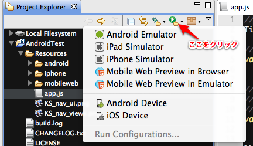
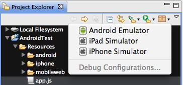

3-1.Hello, TiWorld!

Titanium Studio自体の説明はこれぐらいにして、最初の一歩を踏み出すべく、いわゆるHello Worldアプリケーションの作成に取り掛かりましょう。

#プロジェクト作成

まずプロジェクトの新規作成ですが、Titanium Studioの"File"メニューやProject Explorerの背景部の右クリックから```New Project```選択します。
プロジェクト作成ウィザード画面が表示され、まずプロジェクトテンプレートを選択する段となります。


ここでは"Titanium Mobile Project”を選択してください。



続いて、プロジェクト設定画面に遷移します。

設定内容として次のように入力して、Nextボタンをクリックしてください。
必須項目が埋まっていないとエラーとなります。

<table border="2">
<tr><th>項目</th><th>設定値（例）</th><th>補足</th></tr>
<tr><th>Project Name</th><td>test</td><td>アプリケーションの名前です。<br />
一度命名した後の変更は面倒です。<br/>
注意点については後述します。</td></tr>
<tr><th>Use defalt location
ならびに
Location</th><td>true<br /><br />
/Users/donayama/Documents/Titanium Studio Workspace/test</td><td>標準状態ではユーザの書類フォルダ・マイドキュメントフォルダ内にTitanium Studio Workspaceというフォルダが設定され、そこにProjectNameベースのパスが設定されます。<br />
ユーザ名として漢字などのマルチバイト文字を使っていたりすると、不都合が生じるのでその場合はUse default locationのチェックを外して、任意のフォルダを指定してください。</td></tr>
<tr><th>App Id</th><td>com.twitter.donayama.test</td><td>アプリケーションを一意に判別するIDです。<br />
Javaの名前空間のようにドメイン名を反転させた名前の付け方をすることが推奨されており、<strong>必ず１つ以上のピリオドがないとエラー</strong>となります。</td></tr>
<tr><th>Company / Personal URL</th><td>http://twitter.com/donayama</td><td>Publisher URLという項目に反映されます。</td></tr>
<tr><th>Titanium SDK version</th><td>2.0.0</td><td>特段の問題がない限り、最新の安定バージョンを選択しましょう。</td></tr>
<tr><th>Deployment Target</th><td>iPhone/iPad/Android/Mobile Web</td><td>開発対象となるプラットフォームを選択します。<br />
iPhoneとiPadを選択した場合はユニバーサルアプリケーションとしてビルドされるようになります。<br />
configure...リンクによりAndroid SDKのパスを指定できます。</td></tr>
<tr><th>Cloud Settings</th><td>false</td><td>Appcelerator Cloud Serviceを用いる場合に有効にします。<br />
ここではひとまずオフにしておきます。</td></tr>
</table>

Project Name欄について次のような注意点があります。（本来であればTitanium Studio側で入力チェックしてくれればいいのですが、現時点ではそうではないのでご注意ください）

漢字などの日本語文字はビルドエラーになります。（さらにいうと上位フォルダなどにも日本語文字を含まないほうが望ましいです）
「Titanium」という文字列を含んでいてはいけません。

iOSの場合 英数字11桁を超える名前をつけるとホーム画面で「…」で省略されます。
Androidではハイフン "-" を入れると不具合の原因になります。

尚、Android SDKのインストール先が認識されていない場合は、画面例のようにAndroidの表示がグレイがかったものになり選択できない状態になります。右側にある「configure...」リンクを選択し、適切なSDKパスを選択してください。

プロジェクト作成画面の処理が完了すると、ひな形に基づいたフォルダがLocationとして指定されたフォルダに自動生成され、画面もプロジェクト編集画面に遷移します。



プロジェクト作成時に生成されるひな形には簡単なスケルトンコードが含まれています。
早速これをビルドして実行しましょう。

プロジェクトのファイルが表示されている上にあたるツールバー部分にある矢印ボタンをクリックし、ここから Android Emulator、iPad Simulator、iPhone Simulatorのいずれかを選択してください。（iOS DeviceやAndroid Deviceについてはあとで説明します）



Deployment Targetに指定されていないプラットフォームについては表示されません。

##iPhone(iPod touch)/iPadの場合
iPhone SimulatorもしくはiPad Simulatorの項目選択時は自動的に最新のiOS SDKに基づきビルド・実行がされます。



使用するiOS SDKのバージョンを変更したい場合はRun Configurations...を設定します。設定しない場合はデフォルト設定に基づき、自動作成されます。
Titanium iOS Simulatorを選択し、ウィンドウの左上にあるNewを選択します。

Newを選択すると、設定画面が表示されますので、Project欄の右側にあるBrowse...ボタンをクリックし、対象となるプロジェクト（ここではtest）を選択します。

その後、Device種別(iPhone/iPad)やiOS SDKのバージョンをプルダウンから選択し、Applyで保存できます。

再び先程のツールバーに戻って来ますが、こちらでiPhone SimulatorもしくはiPad Simulatorをクリックすることにより、ビルドが開始されます。プロジェクト作成後の初回ビルドは**「フルビルド」**作業が行われるため、 開発環境のスペックにも依存しますが多少時間が掛かります。
二度目以降は「フルビルド」しないため即座にビルドが終了し、iOSシミュレータが起動するようになりますので、ご安心ください。



##Androidの場合
Android Emulatorを選択すると、一番新しいSDKに基づいたTitanium用の仮想デバイスが自動作成され実行されます。


このSDKのバージョンやScreenサイズの選択を事前に行うことができます。iOSの同様にRun Configurations...を選択し、Titanium Android Emulatorの項を追加してください。
プロジェクトを選択後、Android SDKの項目とScreenの項目のプルダウンから適切な値を選択してApplyボタンをクリックしてください。

残念ながら、iOSシミュレータとは異なりAndroidエミュレータは**起動が大変遅く**、仮想デバイスへのアプリケーションもかなり時間がかかる遅いものとなっています。

#デバッグ機能について
ちなみにTitanium Studioで提供されるDebug機能があります。（古いドキュメントを見ると、有償ユーザ向けのみとなっていますが、Titanium Studio Ver.1.0.2からは全ユーザに対して一般公開されています）

デバッグ機能は実機に対しての実行はできませんが、iPhoneシミュレータ・Androidエミュレータ上での実行時に以下のような処理を行うことが出来ます。

- あらかじめ設定したソース行（ブレイクポイント）や条件によるブレイクの設定
- 「デバッグ」パースペクティブでの式評価の実行
- コールスタックの確認
- サスペンド中の変数の展開や変更
- シミュレータ上でアプリの一時停止やステップ実行

##デバッグ実行方法
ツールバーの左側にある虫のアイコンをクリックすると表示される候補から実行したいプラットフォームを選択することによってデバッグ実行されます。
ブレイクポイントなどの設定をしていない場合はほとんど通常の実行と変わりません。
「デバッグ」パースペクティブに変更することにより、多彩な評価・検証が可能となります。




ちなみにデバッグパースペクティブには画面右上隅にあるパースペクティブ選択ツールバーにあるDebugを選択すれば切り替わります。

##ブレイクポイントの設定

ソースコードの左端のグレイの部分を右クリックすると、「Toggle BreakPoint」というメニューが出るのでこちらを選択します。以下の例では61行目にブレイクポイントを仕掛けた結果、行番号2の左側に水色の丸印が表示されます。この丸印がブレイクポイントを示しています。
なお、丸印の表示されているあたりをダブルクリックすることでもブレイクポイントのON/OFFの切替が可能です。



デバッグ実行中に新たにブレイクポイントを設定し、そこに到達した場合、次のようなパースペクティブの自動切換え確認ダイアログが表示されます。ここでYesボタンをクリックすると、デバッグパースペクティブに切り替わります。

##デバッグパースペクティブ
デバッグパースペクティブに切り替わると、標準では大きく5つのViewに分割されています。
そのうち、上部の二つのViewについて紹介します。

まず左上にあるのがDebug Viewです。実行プロセスやスレッドの情報などが表示されていますが、よく使う部分となるのが右上のツールバーのパートと思います。



その部分だけを拡大したのが下図です。



統合開発環境での開発をしたことがある方にはお馴染みの処理ではありますが、再生ボタンや一時停止ボタン・停止ボタンはデバッグプロセスの実行状態をコントロールするものです。

再生ボタンのアイコンはブレイクポイント以降の処理を（次のブレイクポイントまで）走らせるResumeボタン、現在はグレイアウトしていますが、Pauseボタンを押すと実行中の処理部分で停止、そして赤色の停止（Terminate）ボタンを押すとデバッグプロセス自体が終了します。

次のブロックに下向きの矢印が二つ並んでいますが、これはStep IntoとStep Overと呼ばれるステップ実行時によく利用するボタンです。前者は現在の評価行の次にその中で実行されている処理まで深堀りするのに対して、後者はそのまま次の行に進みます。

一方、右上のViewはステップ実行時の変数状態を確認したり、ブレイクポイントの一覧、指定した式や値の状態を確認することができるブロックです。
以下の例は実行中にlabel2のプロパティを展開しているケースです。オブジェクトがTiUILabelであり、textプロパティの値が"I am Window2"であるとなっています。
実行時にTitanium.API.infoなどを使ってログ欄にプリントデバッグをしなくとも、これで確認できるというわけです。



#実機での実行
エミュレータでの動作が確認できましたので、続いて実機で動かしてみましょう。

##iOS(iPhone/iPad/iPod touch)の場合
iOSデバイスで実機検証するためには前述した通りiOS Developer Programへ登録をした上で、Provisioning Profileという証明書を用意する必要があります。

iOS Provisioning Portalにアクセスするとページ下部に「Get your application on an iOS with the Development Provisioning Assistant」と書かれた欄があり、その下部に「Launch Assistant」というボタンがあります。これをクリックし、画面の指示に従って項目を登録し、開発者証明書（Development Certificate）・WWDR intermediate・開発用プロビジョニングプロファイル（Development Provisioning Profile）をダウンロードします。
手順については画面右端にHow-To'sというパネルにある解説ビデオをご参照下さい。

続いてTitanium StudioのツールバーからiOS Deviceを選択します。



選択するとDeveloper証明書選択やSDK選択が表示されます。
取得した開発用のProvisioning Profileを「Upload」リンクで選択し、ファイル選択画面が表示されますので、対象となるファイルを選択してください。
その後、ビルドターゲットとなるSDKのバージョンや開発者証明書を選択して下さい。



Finishボタンを押すと、ビルドと実機へのインストール処理が開始されます。
内部でXcodeを呼び出す実機実行用のビルド処理（シミュレータ用と異なりフルビルド以上の時間が掛かる）を行いインストールファイルを作成、iTunes経由でアプリケーションの実機インストールを行います。
なお、iTunesでインストールする対象となるデバイスとの同期設定がされていないと、最終的に実機に転送されません。

##Androidの場合
あらかじめ実機の設定画面で「USBデバッグ」を有効にしたAndroid端末をケーブル接続しておき、Android Deviceを選択してください。



エミュレータ起動が遅い反面、実機への転送はiOSに比べて迅速に行うことができますので、Titanium MobileでAndroid開発をする際にはエミュレータではなく初めから実機転送をしているケースもあるようです。
なお、Titanium Studio上で転送完了しているように見えて、インストール出来ていないときはオフライン状態と認識されている可能性があります。
その場合は、実機の設定画面でUSBデバッグを一旦解除して、再度有効にすると転送できるようになることがあります。オフラインになっているかどうかはddmsコマンドやadbコマンドの実行により確認できます。

```
adb devices
```